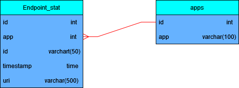

## Это  проект "java-explore-with-me "


Приложение **умеет**:
1. Добавлять пользователя/события/категории/подборки событий/заявки на события
2. Администрирование
3. Удаление пользователя/события/категории/подборки событий/заявки на события
4. Изменения пользователя/события/категории/подборки событий/заявки на события
5. Получение пользователя/события/категории/подборки событий/заявки на события

Ссылка на  Pull requests : https://github.com/KraynovAlexander/java-explore-with-me/pull/2
# Пояснение:
## Схема Базы данных




## Архитектура программы


### Протестировать программу можно с помощью postman
#### [тесты postman для main-service](postman/ewm-main-service.json)
#### [тесты postman для stats-service](postman/ewm-stat-service.json)


Приложение написано на Java. Пример кода:
```java
public class Main {
    public static void main(String[] args) {
        System.out.println("Hello Word");
    }
}

```
------
Научиться  этому можно  [Яндекс-Практикуме](https://practicum.yandex.ru/java-developer/ "Тут учат Java!")